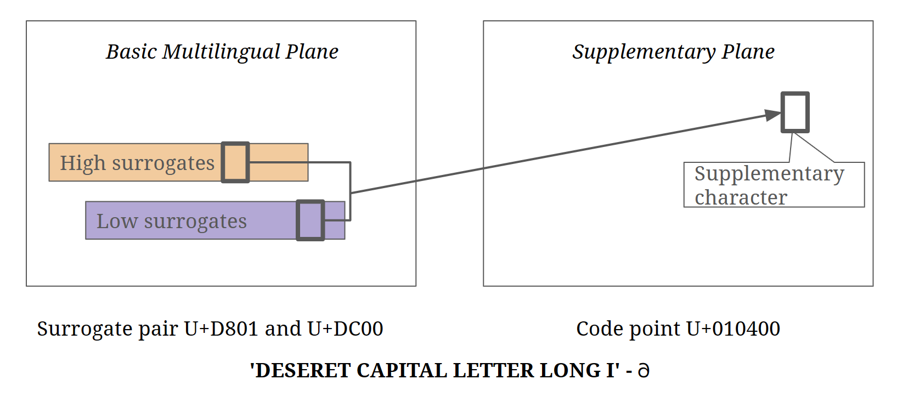

# What a Character

**Sualeh Fatehi**


## Agenda

- Character and Script Concepts
- Unicode
- Characters and Strings in Java
- Encodings
- Reading and Writing


## Not On The Agenda

- Fonts and Typefaces
- Locales and Localization
- HTML and XML Escapes
- Supporting Bidirectional Text
- Determining Text Boundaries and Tokenization
- Typing text and input methods


## The Tower of Babel

- Explains the confusion of tongues
- Humans are divided into linguistic groups
- Programmers seek to deal with these differences


The Tower of Babel
by Pieter Bruegel the Elder (1563)


## Scripts

We will deal mainly with the written form of language, or scripts, in this discussion...


## Characters and Glyphs

- **Character** – unit of information representing an indivisible unit of text
- **Glyph** – a unit of visual representation of a character or characters


## Precomposed Characters

- **Combining mark** - modeled as a character, intended to modify other characters - for example, diacritical marks and accents
    For example, **e + ̆  = ĕ**
- **Precomposed character** - may typically represent a letter with a diacritical mark
    For example, **é = e + ́**

Precomposed characters may need to be normalized into combining characters for sorting and processing.


## Challenges Of Representing Characters

- Uppercase and lowercase
    **A** versus **a**
- Word final variants
    **ς** versus **σ**
- Context sensitive placement
    **◌ू** placed differently for **रू** versus **धू**
- Consonant clusters
    **क्ष** for ksh


## Characters

Let us assume that an expert committee has figured out what a character is, and continue with the discussion...


## Character Sets

- **Coded character set** - a set of characters with a unique number for each character
- **Code point** - unique number assigned to each character in a set
- **Code page** - table of values for a coded character set


## Common Code Pages

- **ASCII** - code page of 128 code points, encoded with 7 bits
- **Latin-1** or **ISO-8859-1** - code page of 256 code points, retaining ASCII code points, plus Western European languages
- **ISO-8859-n** - many code pages of 256 code points, retaining ASCII code points, plus other European languages such as Greek
- **EBCDIC** - many code pages of 256 code points each, with no connection to ASCII code points


## The Problem

- A given character can have a different code point in different coded character sets or code pages
- Not all characters in a language may be coded


## The Solution


## Unicode Support

- Most modern operating systems
- All modern browsers
- Most modern programming languages


## Unicode

- Provides a unique number (code point) for every character
- Code space of 1,114,112 code points
- Code points for 149,186 characters covering modern and historic scripts, symbols and emojis
- Consists of character properties, rules for normalization, collation, rendering, and bidirectional display order
- Promotes lossless roundtrip transcoding


## Unicode Character Classifications

- Characters have a unique and immutable name
- Characters are not ordered
- Unicode does not move characters
- Characters are not tagged by language


## Unicode Character Classifications

- Each code point falls into a single **General Category**
- Major classes are Letter, Mark, Number, Punctuation, Symbol,
    Separator
- Each major class has subclasses


## Unicode Character Category Example

| **L** | Letter |
| --- | --- |
| **Lu** | Letter, uppercase |
| **Ll** | Letter, lowercase |
| **Lt** | Letter, titlecase |
| **Lm** | Letter, modifier |
| **Lo** | Letter, other |


## Planes

- **Code point plane** - contiguous group of 65,536 (or 2<sup>16</sup>) code points
- 17 planes, identified by the numbers 0 to 16 decimal
- 11 planes are empty
- Planes divided into blocks, such as "Hebrew script characters"


## Named Planes

- Plane 0 - **Basic Multilingual Plane (BMP)**
- Plane 1 - **Supplementary Multilingual Plane (SMP)**, for ancient scripts and musical and mathematical notation
- Plane 2 - **Supplementary Ideographic Plane (SIP)**, for ideographic characters from Asian languages


## Code Planes


https://www.w3.org/International/articles/definitions-characters/


## Usage Heat Map


Created by Nathan Reed from a large sample of text from Wikipedia and Twitter shows usage of first three planes.

## Referencing a Unicode Code Point

- Code points are prefixed with U+
- Code point is written in hexadecimal
- First two digits are the code point plane, 00 is optional
- Next four digits are the code point within the code page

So, "LATIN CAPITAL LETTER X" can be either 
U+0058 or U+000058


## Heard This?

> In a properly engineered design, 16 bits per character are more than sufficient...

From the _first_ Unicode standard


## Surrogate Pairs

- **Surrogates** are reserved code points on the Basic Multilingual Plane, not mapped to any character
- Allow addressing characters in Supplementary Planes
- 1024 high surrogates, and 1024 low surrogates
- **Surrogate pair** consists of a high surrogate followed by a low surrogate
- Can address 1,024 × 1,024 = 1,048,576 code points in the other 16 planes


## Surrogate Addressing




## Brief History

- First draft, Unicode 88 released August 1988
- Unicode 15.0 released September 2022

Unicode 15.0 adds new scripts, and additional emojis.


## Unicode with Java

Unicode with Java


## Java Support For Unicode

| Java Version | Unicode Version |
| --- | --- |
| JDK 1.0 | Unicode 1.1 |
| JDK 1.1, 1.2 | Unicode 2.0 |
| J2SE 5.0 * | Unicode 4.0 |
| Java SE 8 | Unicode 6.2 |
| Java SE 11 | Unicode 10.0 |
| Java SE 17 | Unicode 13.0 |

* Supplementary characters assigned in Unicode 3.1


## What is a Java `char`?

So, what is a Java `char`?


## What is a Java `char`?

- Java `char` is 16 bits
- The only unsigned primitive data type
    (Java 8 allows unsigned operations on `int` and `long`)
- Numeric value is a code point on the Basic Multilingual Plane


## Java Tries to Cope

But, Unicode code points

- cannot be represented by 16 bits
- need at least 5 + 16 = 21 bits


## Java Tries to Cope

So,

- For compatibility with Java 1.0, a `char` is still 16 bits
- Java uses **surrogate pairs** for characters outside the BMP
- Java 5 APIs allow for `int` code points instead of surrogate pairs


## Java Unicode Character Literals

Inside single quotes.

```java
char ch1 = 'a';
char ch2 = '東';
char ch3 = '𐐀'; // (Not a BMP character!)
```


## Java Unicode Character Literals

- `\uHHHH` - where H is a case-insensitive hexadecimal character
- Only supports the Basic Multilingual Plane
- Supplementary characters are written as **surrogate pairs**

```java
char ch = '\u00EA'; // ‘ê’
String str1 = "a\u00ea\u00f1\u00fcc"; // “aêñüc”
String str2 = "A\u00EA\u00F1\u00FCC"; // “AêñüC”
```


## Java Unicode Code Point Literals

- `0xHHHHHH` - where H is a case-insensitive hexadecimal character
- No surrogate pairs needed
- Not all Java APIs support `int` code points


## Java Unicode Code Point Literals

```java
// 'DESERET CAPITAL LETTER LONG I' - 𐐀
int cp = 0x010400; 
String str = new StringBuffer()
                 .appendCodePoint(cp)
                 .toString();
```

**Result:**

`str.length()` is 2
`str.codePointCount()` is 1


## Compact Strings

- Before Java 9, strings were internally `char[]`
- Java now represents strings internally as `byte[]`
- External APIs are unchanged
- Two encodings are supported internally
  - UTF-16 uses one or two bytes per character
  - Latin-1 uses one byte per character


## Java and Unicode

```java
String greekWord = "ΣΚΎΛΟΣ"; // dog
String greekLower = greekWord.toLowerCase();
```

**Result:**
`greekLower` is "σκύλος"
(Notice that the first and last letter are both sigma)


## Java and Unicode

```java
String germanWord = "straße"; // street
String germanUpper = germanWord.toUpperCase();
```

**Result:**
`germanUpper` is "STRASSE"
(Notice that the string lengths are different)


## Java Integer Parsing

```java
String hindiNumber = "१२३४५६७८९०";
int number = Integer.parseInt(hindiNumber);
```

**Result:**

`number` is 1234567890


## Java Regular Expressions

```java
String hindiNumber = "१२३४५६७८९०";
Pattern.compile("[0-9]*") // bad match
       .matcher(hindiNumber).matches();
Pattern.compile("\\p{Nd}*") // good match
       .matcher(hindiNumber).matches();
```

**Result:**
First match is false but second match is true


## Java Patterns

```java
Pattern pattern = Pattern.compile("σκύλος",
    Pattern.CASE_INSENSITIVE | Pattern.UNICODE_CASE);

pattern.matcher("ΣΚΎΛΟΣ").matches();
```

**Result:**
Match is true


## Use the Character Class

**_NOT_**
```java
char ch; // some value assigned...
if ((ch >= 'a' && ch <= 'z') ||
    (ch >= 'A' && ch <= 'Z'))
// ...
```

**_BUT_**
```java
int cp; // some value assigned...
if (Character.isLetter(cp))
// ...
```

## Use the Character Class

**_NOT_**
```java
char ch; // some value assigned...
if (ch >= '0' && ch <= '9')
// ...
```

**_BUT_**
```java
int cp; // some value assigned...
if (Character.isDigit(cp))
// ...
```


## Use the Character Class: But Carefully?

```java
// ‘LATIN SMALL LETTER SHARP S’
char germanChar = 'ß'; 
char germanCharUpper = Character
                       .toUpperCase(germanChar);
```

**Result:**
`germanCharUpper` is 'ß' (but we expect "SS")
(No exception is thrown, and no conversion is done!)


## Use `int` Instead of `char` in Java

Many `Character` static methods take `int` code points

- `boolean isDigit(int codePoint)`
- `int toLowerCase(int codePoint)`

As do some `String` methods

- `int indexOf(int ch)`
- `new String(int[] codePoints, int offset, int count)`


## Iterate Over Code Points

Iterate over code points using `String.codePoints()` streams

- `"text".codePoints().forEach(System.out::print)`
- `"text".codePoints().toArray()`


## Surrogates and Code Points

`Character` static methods allow conversions from surrogate pairs to code points

- `char[] toChars(int codePoint)`
- `boolean isSurrogatePair(char high, char low)`
- `int codePointAt(char[] a, int index)`


## Beware of Breakage

- Some `String` methods, such as `substring(...)` and `length()` do not understand surrogates
- `StringBuilder` `delete(...)` method may not work as intended


## Encoding 

Encoding specifies conversion of characters to bytes


## Encoding

- **Encoding** is the process of converting code points to a byte representation
- **Decoding** is the process of converting a stream of bytes to code points
- Encoding or decoding may not always be successful


## Common Encodings

```
| Unicode Code Point | U+0041 | U+00DF | U+6771 | U+010400 |
| --- | --- | --- | --- | --- |
| Glyph | A | ß | 東 | 𐐀 |
| UTF-32 bytes | 00 00 00 41 | 00 00 00 DF | 00 00 67 71 | 00 01 04 00 |
| UTF-16 bytes | 00 41 | 00 DF | 67 71 | D8 01 DC 00 |
| UTF-8 bytes | 41 | C3 9F | E6 9D B1 | F0 90 90 80 |
```


## UTF-32

- Four bytes for all characters
- Does not need surrogate pairs


## UTF-16

- Two bytes for BMP characters
- Four bytes for supplementary plane characters
- Uses surrogate pairs


## UTF-16 Encoding

```
Bits in
Code
Point
```
```
From
Code
Point
```
```
To
Code
Point
```
```
Characters Byte 1 Byte 2 Byte 3 Byte 4
```
```
16 U+0080 U+FFFF BMP characters xxxxxxxx xxxxxxxx
20 U+10000 U+10FFFF Supplementary plane characters 110110 xx xxxxxxxx 110111 xx xxxxxxxx
```

## UTF-8

- Most common encoding today
- One byte for ASCII characters
- Two or three bytes for BMP characters
- Four bytes for supplementary plane characters
- Does not need surrogate pairs


## UTF-8 Encoding

```
Bits in
Code
Point
```
```
From
Code
Point
```
```
To
Code
Point
```
```
Characters Byte 1 Byte 2 Byte 3 Byte 4
```
```
7 U+0000 U+007F ASCII characters 0 xxxxxxx
11 U+0080 U+07FF European characters, Arabic, Hebrew 110 xxxxx 10 xxxxxx
16 U+0800 U+FFFF BMP characters, including CJK 1110 xxxx 10 xxxxxx 10 xxxxxx
21 U+10000 U+1FFFFF Supplementary plane characters 11110 xxx 10 xxxxxx 10 xxxxxx 10 xxxxxx
```

## Charset

- Numerous character-encoding schemes supported via the `Charset` class
- Not all encoding schemes may be installed by default
- Many IBM EBCDIC code pages are supported
- StandardCharsets defines encodings that are always available
- Every encoding has a **canonical name** or MIME-preferred name


## Encoding Details

Glyph (^) **A ß** 東 𐐀
UTF-32 bytes 00000000 00000000000 0 100000100000 00000000 000 00000000 1101111100000 00000000 000 0 1100111 01110001^00000 00000000 000 00000 100 00000000^00001
UTF-16 bytes 00000000 0^100000100000000 110111110 1100111 01110001^^110110110111^00 00 00000000^00000001
UTF-8 bytes^0^1000001^110^00011^10^011111^111010 1100010110^10^011101^1111010 010000000^1010^010000000000
● **_bold text_** – header bits
● grey highlight – insignificant code point bits
● blue highlight – significant code point bits
● yellow highlight – code point page


## Converting to Bytes

- Always specify encoding to avoid cross-platform surprises

```java
try {
  String original = ....
  byte[] utf8Bytes = original.getBytes("UTF-8");
  String roundTrip = new String(utf8Bytes, "UTF-8");
}
catch (UnsupportedEncodingException e) { }
```

## Streams and Readers

- **Streams** read and write bytes
- **Readers** read characters from a byte stream
- **Writers** write characters to a byte stream
- Always specify encoding to avoid cross-platform surprises


## Code Examples

```java
InputStream fis = new FileInputStream("in.txt");
Reader isr = new InputStreamReader(fis, "UTF-8");

InputStreamReader
(specify encoding)
```
raw bytes (^) Unicode
characters
OutputStream fos = new FileOutputStream("out.txt");
Writer out = new OutputStreamWriter(fos, "UTF-8");
OutputStreamWriter
(specify encoding)
Unicode raw bytes
characters


## String Data in Databases

- `VARCHAR` and `CHAR` specify lengths in bytes, by default
- `NVARCHAR` and `NCHAR` specify lengths in characters, but average to a certain multiplier for bytes


## Where Do You Truncate?

- How and where do you truncate string “Aß東𐐀”?

Glyph (^) **A ß** 東 𐐀
Java char 0041 00DF^6771 D801 DC00^
UTF-8 bytes 41 C3 9F^ E6 9D B1^ F0 90 90 80^


## Normalize Text

- Normalize text for comparison and sorting
- Java supports all the Unicode normalized forms
- Use the Normalizer class

For example, the normalized decomposition of "schön" is "scho\u0308n"

U+0308 is a 'COMBINING DIAERESIS', or ◌̈


## Code Examples

Slides and all code examples are on GitHub
https://github.com/sualeh/What-a-Character


## Questions


