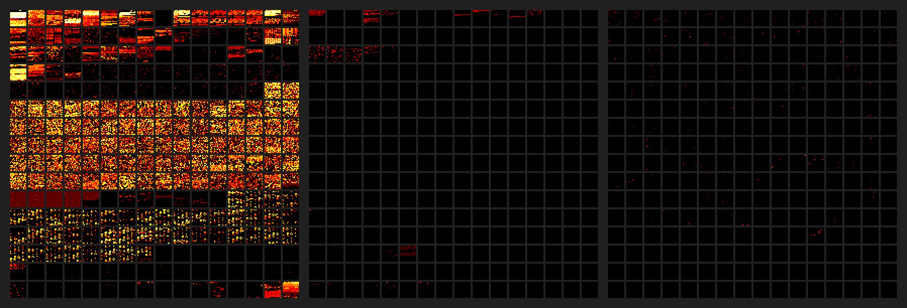

# What a Character

**Sualeh Fatehi**

## Agenda

- Character and Script Concepts
- Unicode

## Not On The Agenda

- Fonts and Typefaces
- Locales and Localization
- HTML and XML Escapes
- Supporting Bidirectional Text
- Determining Text Boundaries and Tokenization
- Typing text and input methods

## The Tower of Babel

- Explains the confusion of tongues (or languages)
- Programmers seek to deal with these differences

The Tower of Babel
by Pieter Bruegel the Elder (1563)

## Scripts

We will deal mainly with the written form of language, or scripts, in this discussion...

## Characters and Glyphs

- **Character** – unit of information representing an indivisible unit of text
- **Glyph** – a unit of visual representation of a character or characters

## Precomposed Characters

- **Combining mark** - modeled as a character, but modifies other characters, such as diacritical marks and accents
    For example, **e + ̆  = ĕ**
- **Precomposed character** - typically a letter with a diacritical mark
    For example, **é = e + ́**

Precomposed characters may need to be normalized into combining characters for sorting and processing.

## Challenges of Representing Characters

| Challenge | Example |
| --- | --- |
| Uppercase, lowercase and title case | **A** versus **a** |
| Word final variants | **ς** versus **σ** |
| Context sensitive placement | **◌ू** placed differently for **रू** versus **धू** |
| Consonant clusters | **क्ष** for ksh |

## Characters

Let us assume that an expert committee has figured out what a character is, and continue with the discussion...

## Character Sets

- **Coded character set** - a set of characters with a unique number for each character
- **Code point** - unique number assigned to each character in a set
- **Code page** - table of values for a coded character set

## Common Code Pages

- **ASCII** - code page of 128 code points, encoded with 7 bits
- **Latin-1** or **ISO-8859-1** - code page of 256 code points, retaining ASCII code points, plus Western European languages
- **ISO-8859-n** - many code pages of 256 code points, retaining ASCII code points, plus other European languages such as Greek
- **EBCDIC** - many code pages of 256 code points, with no connection to ASCII code points

## The Problem

- A given character can have a different code point in different coded character sets or code pages
- Not all characters in a language may be coded

## The Solution

## Unicode Support

- Most modern operating systems
- All modern browsers
- Most modern programming languages

## Unicode

- Provides a unique number (code point) for every character
- Code space of 1,114,112 code points
- Code points for about 150 thousand characters covering modern and historic scripts, symbols and emojis
- Consists of character properties, normalization rules, collation, rendering, and bidirectional display order
- Promotes lossless roundtrip transcoding

## Unicode Character Classifications

- Characters have a unique and immutable name
- Characters are not ordered
- Unicode does not move characters
- Characters are not tagged by language

## Unicode Character Classifications

- Each code point falls into a single **General Category**
- Major classes are Letter, Mark, Number, Punctuation, Symbol, Separator
- Each major class has subclasses

## Unicode Category Example

| **L** | Letter |
| --- | --- |
| **Lu** | Letter, uppercase |
| **Ll** | Letter, lowercase |
| **Lt** | Letter, titlecase |
| **Lm** | Letter, modifier |
| **Lo** | Letter, other |

## Planes

- **Code point plane** - contiguous group of 65,536 (or 216) code points
- 17 planes, identified by the numbers 0 to 16 decimal
- 11 planes are empty
- Planes divided into blocks, such as "Hebrew script characters"

## Named Planes

- Plane 0 - **Basic Multilingual Plane (BMP)**
- Plane 1 - **Supplementary Multilingual Plane (SMP)**, for ancient scripts and musical and mathematical notation
- Plane 2 - **Supplementary Ideographic Plane (SIP)**, for ideographic characters from Asian languages

## Code Planes

## Usage Heat Map

Created by Nathan Reed from a large sample of text from Wikipedia and Twitter shows usage of first three planes.

## Referencing a Unicode Code Point

- Code points are prefixed with U+
- Code point is written in hexadecimal
- First two digits are the code point plane, 00 is optional
- Next four digits are the code point within the code page

So, "LATIN CAPITAL LETTER X" can be either 
U+0058 or U+000058

## Heard This?

> In a properly engineered design, 16 bits per character are more than sufficient...

From the _first_ Unicode standard

## Surrogate Pairs

- **Surrogates** are reserved code points on the Basic Multilingual Plane, not mapped to any character
- Allow addressing characters in Supplementary Planes
- 1024 high surrogates, and 1024 low surrogates
- **Surrogate pair** consists of a high surrogate followed by a low surrogate
- Can address 1,024 × 1,024 = 1,048,576 code points in the other 16 planes

## Surrogate Addressing

## Brief History

- First draft, Unicode 88 released August 1988
- Unicode 15.1.0 released September 2023
- Has 149,813 characters

Unicode 15.0 added new scripts, and additional emojis. Unicode 15.1.0 adds new characters.

## Code Examples

Slides and all code examples are on GitHub
[https://github.com/**sualeh/What-a-Character**](https://github.com/sualeh/What-a-Character)

