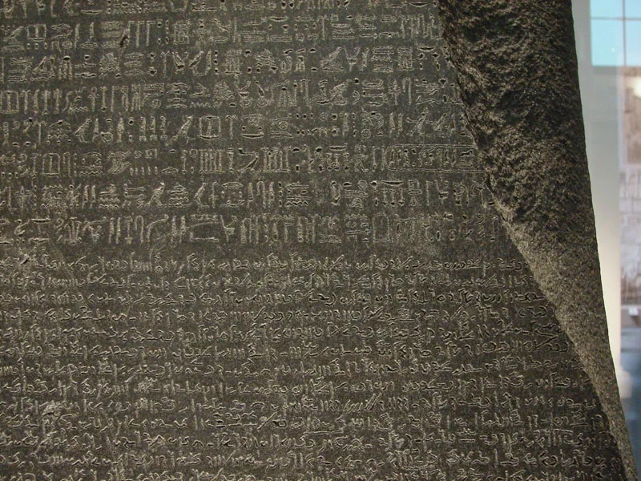
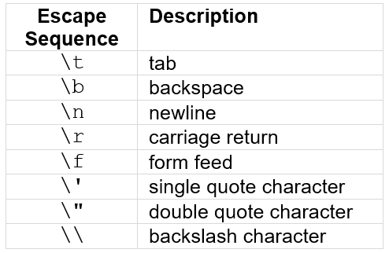

# What a Character

Unicode Support in JavaScript

**Sualeh Fatehi**


## Unicode with JavaScript




## JavaScript Characters

- Internally, a character in JavaScript is 16 bits
- JavaScript uses **surrogate pairs** for characters outside the BMP
- JavaScript APIs allow for integer code points instead of surrogate pairs


## Unicode Character Literals

```javascript
ch1 = 'a'
ch2 = '東' // (Not an ASCII character!)
ch3 = '𐐀' // (Not a BMP character!)
```


## Unicode Character Literals

- `\uHHHH` - where H is a case-insensitive hexadecimal character
- Only supports the Basic Multilingual Plane
- Supplementary characters are represented as **surrogate pairs**

```javascript
ch5 = '\u00EA'; // ‘ê’
str1 = "a\u00ea\u00f1\u00fcc"; // “aêñüc”
str2 = "A\u00EA\u00F1\u00FCC"; // “AêñüC”
```


## Unicode Character Literals

- Supplementary characters are written as **surrogate pairs**

```javascript
// Character outside the BMP
str3 = "\uD801\uDC00"; // ‘𐐀’
```

**Result:**

length `str3.length` is 2
code points `Array.from(str3).length)` is 1


## Unicode Code Point Literals

- `0xHHHHHH` - where H is a case-insensitive hexadecimal character
- Specify code plane with code point
- No surrogate pairs needed


## Unicode Code Point Literals

```javascript
// Character outside the BMP
cp1 = 0x010400; // 𐐀
str4 = String.fromCodePoint(cp1);
```

**Result:**

length `str4.length` is 2
code points `Array.from(str4).length)` is 1


## Escape Sequences

Built-in escape sequences




## Unicode Cases

```javascript
greekWord = "ΣΚΎΛΟΣ"; // dog
greekLower = greekWord.toLowerCase();
```

**Result:**
`greekLower` is "σκύλος"
(Notice that the first and last letter are both sigma)


## Unicode Cases

```javascript
germanWord = "straße"; // street
germanUpper = germanWord.toUpperCase();
```

**Result:**
`germanUpper` is "STRASSE"
(Notice that the string lengths are different)


## Unicode Integer Parsing

```javascript
hindiNumber = "१२३४५६७८९०";
number = parseInt(hindiNumber);
```

**Result:**

`number` is 1234567890


## Patterns for Unicode Numbers

```javascript
hindiNumber = "१२३४५६७८९०";
digit = /[0-9]+/
matches = digit.test(hindiNumber)
```

**Result:**
Regex does not match a string of Unicode numbers


## Patterns for Unicode Numbers

```javascript
hindiNumber = "१२३४५६७८९०";
standard_digit = /\d+/
matches = standard_digit.test(hindiNumber)
```

**Result:**
Regex does not match a string of Unicode numbers


## Patterns for Unicode Numbers

```javascript
hindiNumber = "१२३४५६७८९०";
unicode_digit = /\p{Nd}+/u
matches = unicode_digit.test(hindiNumber)
```

**Result:**
Matches on patterns with Unicode character properties


## Patterns for Unicode Categories

JavaScript supports pattern matching on Unicode character properties using the "\p{}" syntax.


## Case Insensitive Patterns

```javascript
pattern = /σκύλος/iu
matches = pattern.test("ΣΚΎΛΟΣ");
```

**Result:**
`matches` is true


## Use the Character Class

```java
int cp; // some value assigned...
if (Character.isLetter(cp))
// ...
```

**_INSTEAD OF_**
```java
char ch; // some value assigned...
if ((ch >= 'a' && ch <= 'z') ||
    (ch >= 'A' && ch <= 'Z'))
// ...
```


## Use the Character Class

```java
int cp; // some value assigned...
if (Character.isDigit(cp))
// ...
```

**_INSTEAD OF_**
```java
char ch; // some value assigned...
if (ch >= '0' && ch <= '9')
// ...
```


## Use the Character Class: But Carefully?

```java
// 'LATIN SMALL LETTER SHARP S' - ß
char germanChar = 'ß'; 
char germanCharUpper = Character
                       .toUpperCase(germanChar);
```

**Result:**
`germanCharUpper` is 'ß' (but we expect "SS")
(No exception is thrown, and no conversion is done!)


## Use `int` Instead of `char` in Java

Many `Character` static methods take `int` code points

- `boolean isDigit(int codePoint)`
- `int toLowerCase(int codePoint)`

As do some `String` methods like

- `int indexOf(int ch)`
- `new String(int[] codePoints, int offset, int count)`


## Iterate Over Code Points

Iterate over code points using `String.codePoints()` streams

```java
"text".codePoints().forEach(System.out::print)
```
```java
"text".codePoints().toArray()
```


## Surrogates and Code Points

`Character` static methods allow conversions from surrogate pairs to code points

- `char[] toChars(int codePoint)`
- `boolean isSurrogatePair(char high, char low)`
- `int codePointAt(char[] a, int index)`


## Beware of Breakage

- Some `String` methods, such as `substring(...)` and `length()` do not understand surrogates
- `StringBuilder` `delete(...)` method may not work as intended


## Normalize Text

- Normalize text for comparison and sorting
- Java supports all the Unicode normalized forms
- Use the Normalizer class

For example, the normalized decomposition of "schön" is "scho\u0308n"

U+0308 is a 'COMBINING DIAERESIS', or ◌̈


## Code Examples

Slides and all code examples are on GitHub
[https://github.com/**sualeh/What-a-Character**](https://github.com/sualeh/What-a-Character)


