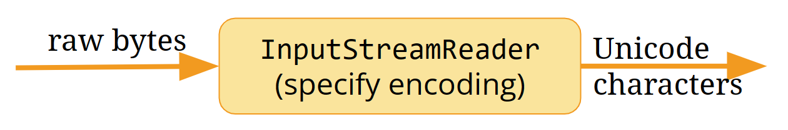
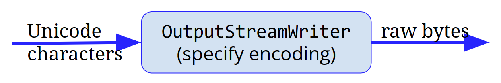
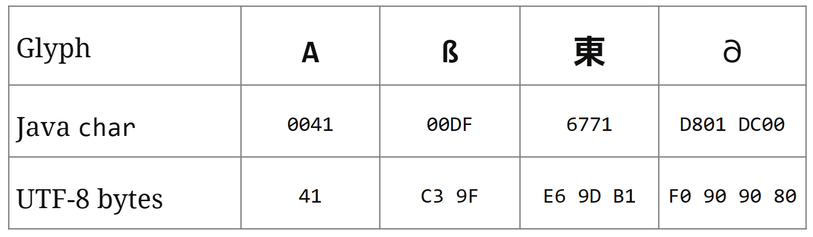

# What a Character

Encoding in Java

**Sualeh Fatehi**


## Encoding 

See the [presentation on encoding concepts](https://sualeh.github.io/What-a-Character/what-a-character-encoding.pdf).


## Compact Strings

- Before Java 9, strings were internally `char[]`
- Java now represents strings internally as `byte[]`
- External APIs are unchanged
- Two encodings are supported internally
  - UTF-16 uses one or two bytes per character
  - Latin-1 uses one byte per character


## Charset

- Numerous character-encoding schemes supported via the `Charset` class
- Not all encoding schemes may be installed by default
- Many IBM EBCDIC code pages are supported
- StandardCharsets defines encodings that are always available
- Every encoding has a **canonical name** or MIME-preferred name


## Converting to Bytes

- Always specify encoding to avoid cross-platform surprises

```java
String original = ....
byte[] utf8Bytes = original.getBytes("UTF-8");
String roundTrip = new String(utf8Bytes, "UTF-8");
// and remember to handle encoding exceptions
```


## Streams and Readers

- **Streams** read and write bytes
- **Readers** read characters from a byte stream
- **Writers** write characters to a byte stream
- Always specify encoding to avoid cross-platform surprises


## Reading Unicode



```java
InputStream fis = new FileInputStream("in.txt");
Reader rdr = new InputStreamReader(fis, "UTF-8");
```

## Writing Unicode



```java
OutputStream fos = new FileOutputStream("out.txt");
Writer wtr = new OutputStreamWriter(fos, "UTF-8");
```


## Explicitly Specify Encoding 

**Always explicitly specify encoding to avoid cross-platform surprises.**
You may not always get errors - just garbled data.


## Where Do You Truncate?

How and where do you truncate string “Aß東𐐀”? 



**TIP:** There is no easy answer. Use a library to truncate strings.


## Code Examples

Slides and all code examples are on GitHub
[https://github.com/**sualeh/What-a-Character**](https://github.com/sualeh/What-a-Character)


