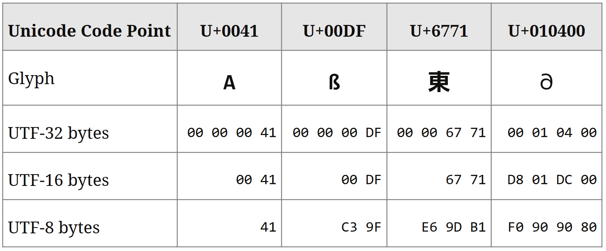
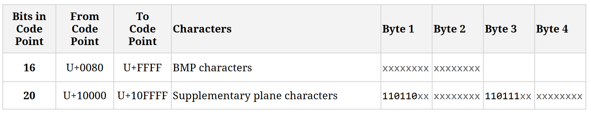
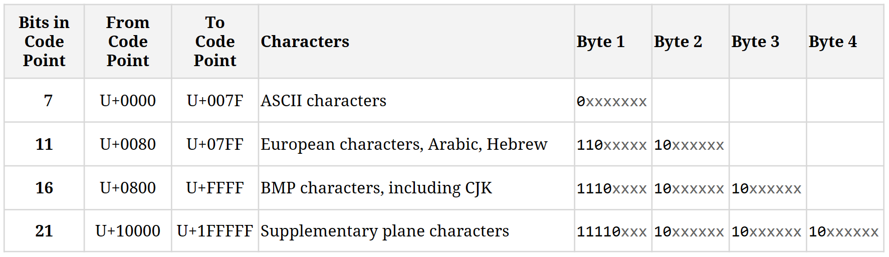
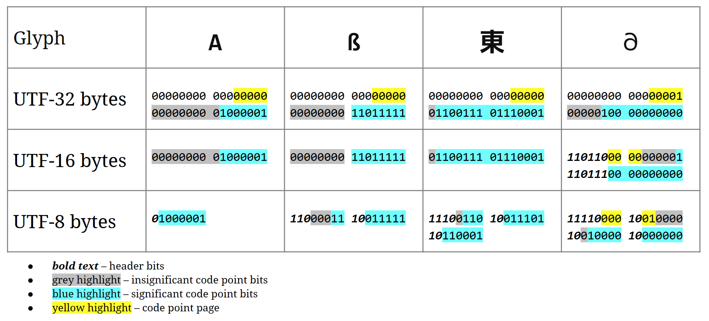

# What a Character

Encoding - Concepts

**Sualeh Fatehi**

## Encoding 

Encoding specifies conversion of characters to bytes

## Encoding

- **Encoding** is the process of converting code points to a byte representation
- **Decoding** is the process of converting a stream of bytes to code points
- Encoding or decoding may not always be successful

## Common Encodings

## UTF-32

- Four bytes for all characters
- Does not need surrogate pairs

## UTF-16

- Two bytes for BMP characters
- Four bytes for supplementary plane characters
- Uses surrogate pairs

## UTF-16 Encoding

## UTF-16 Encoding

- **High surrogates** (two bytes) start with bits   
  **110110** (0xD800)
- **Low surrogates** (two bytes) start with bits   
  **110111** (0xDC00)
- Other bits encode the the supplementary plane and code point

(See previous slide)

## UTF-8

- Most common encoding today
- One byte for ASCII characters
- Two or three bytes for BMP characters
- Four bytes for supplementary plane characters
- Does not need surrogate pairs

## UTF-8 Encoding

## UTF-8 Encoding

- **0** first bit signifies 7-bit ASCII character
- **110** leading bits signify 1 continuation byte
- **1110** leading bits signify 2 continuation bytes
- **11110** leading bits signify 3 continuation bytes
- **10** leading bits signify the continuation byte

(See previous slide)

## Encoding Details

## Base64 Encoding

- Base64 is a binary-to-text encoding scheme
- Base64 does not encode characters or code points
- Encoded text is in "printable" ASCII characters 

On the other hand,
- Unicode encoding schemes encode text-to-binary 

## Code Examples

Slides and all code examples are on GitHub
[https://github.com/**sualeh/What-a-Character**](https://github.com/sualeh/What-a-Character)

