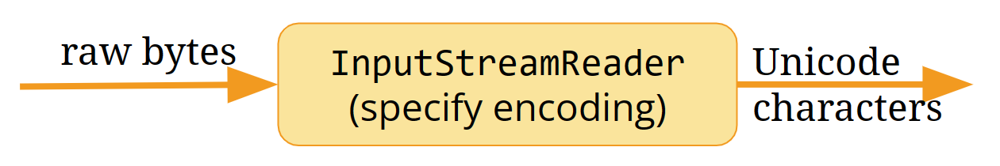
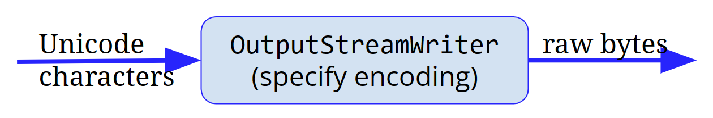

# What a Character

Encoding in Python

**Sualeh Fatehi**


## Encoding 

See the [presentation on encoding concepts](what-a-character-encoding.pdf).


## `codecs`

- Provides functions for encoding and decoding
- Supports a wide variety of encodings
- Provides classes for reading and writing data with a specific encoding
- Handles encoding and decoding errors through different error handling schemes


## Converting to Bytes

- Always specify encoding to avoid cross-platform surprises

```python
original: str = ....
byte[] utf8Bytes = original.getBytes("UTF-8");
String roundTrip = new String(utf8Bytes, "UTF-8");
// and remember to handle encoding exceptions
```

## Streams and Readers

- **Streams** read and write bytes
- **Readers** read characters from a byte stream
- **Writers** write characters to a byte stream
- Always specify encoding to avoid cross-platform surprises


## Reading Unicode



```java
InputStream fis = new FileInputStream("in.txt");
Reader isr = new InputStreamReader(fis, "UTF-8");
```

## Writing Unicode



```java
OutputStream fos = new FileOutputStream("out.txt");
Writer out = new OutputStreamWriter(fos, "UTF-8");
```


## String Data in Databases

- `VARCHAR` and `CHAR` specify lengths in bytes, by default
- `NVARCHAR` and `NCHAR` specify lengths in characters, but average to a certain multiplier for bytes


## Normalize Text

- Normalize text for comparison and sorting
- Java supports all the Unicode normalized forms
- Use the Normalizer class

For example, the normalized decomposition of "schön" is "scho\u0308n"

U+0308 is a 'COMBINING DIAERESIS', or ◌̈


## Code Examples

Slides and all code examples are on GitHub
[https://github.com/**sualeh/What-a-Character**](https://github.com/sualeh/What-a-Character)


