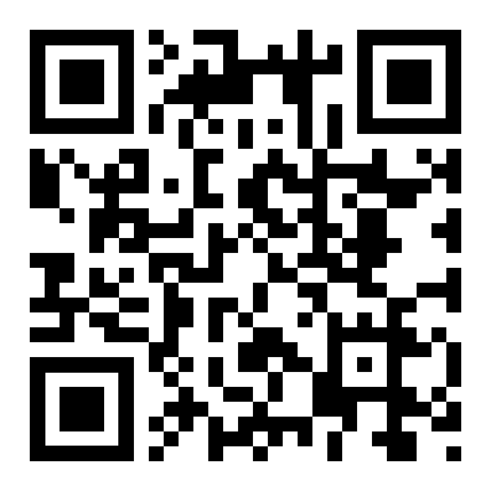

# What a Character

Unicode Support in Python

**Sualeh Fatehi**


## Unicode with Python


## Unicode Character Literals

```python
ch1 = 'a'
ch2 = '東' # (Not an ASCII character!)
ch3 = '𐐀' # (Not a BMP character!)
```
Python can represent characters from the BMP or any other plane.


## Unicode Character Literals

- `\uHHHH` - where H is a case-insensitive hexadecimal character
- Only supports the Basic Multilingual Plane

```python
ch5 = "\u00EA" # ‘ê’
str1 = "a\u00ea\u00f1\u00fcc" # “aêñüc”
str2 = "A\u00EA\u00F1\u00FCC" # “AêñüC”
```


## Unicode Character Literals

- Python does not use **surrogate pairs**
- Use `\U00HHHHHH` instead

```python
# Character outside the BMP
str3 = "\U00010400"  # '𐐀'
```

**Result:**

length `len(str3)` is 1


## Python Unicode Code Point Literals

- `0xHHHHHH` - where H is a case-insensitive hexadecimal character
- Specify code plane with code point
- Supports code points in supplemental planes


## Python Unicode Code Point Literals

```python
# 'DESERET CAPITAL LETTER LONG I' - 𐐀
cp1 = 0x010400      
string = chr(cp1)   
```

**Result:**

`len(string)` is 1


## Python and Unicode

```python
greek_word = "ΣΚΎΛΟΣ"  # dog
greek_lower = greek_upper.lower()
```

**Result:**
`greek_lower` is "σκύλος"
(Notice that the first and last letter are both sigma)


## Python and Unicode

```python
german_word = "straße"  # street
german_upper = german_word.upper()
```

**Result:**
`german_upper` is "STRASSE"
(Notice that the string lengths are different)


## Python Integer Parsing

```python
hindi_number = "१२३४५६७८९०"
number = int(hindi_number)
```

**Result:**

`number` is 1234567890


## Python Regular Expressions

```python
import re

hindi_number = "१२३४५६७८९०"

digit_regex = r"[0-9]*"
match_result = re.match(digit_regex, hindi_number)
matches = bool(match_result)
```

**Result:**
Regex does not match a string of Unicode numbers


## Python Regular Expressions

```python
import re

hindi_number = "१२३४५६७८९०"

digit_regex = r"\d*"
match_result = re.match(digit_regex, hindi_number)
matches = bool(match_result)
```

**Result:**
"\d" matches a digit in any language


## Python Regular Expressions

```python
import regex

hindi_number = "१२३४५६७८९०"

digit_regex = r"\p{Nd}*"
match_result = regex.match(digit_regex, hindi_number)
matches = bool(match_result)
```

**Result:**
Use `regex` to match Unicode character classes


## Python Patterns

```python
import re
match_result = re.match("σκύλος", "ΣΚΎΛΟΣ", re.IGNORECASE)
matches = bool(match_result)
```

**Result:**
`matches` is True


## Code Examples

Slides and all code examples are on GitHub
[https://github.com/**sualeh/What-a-Character**](https://github.com/sualeh/What-a-Character)



